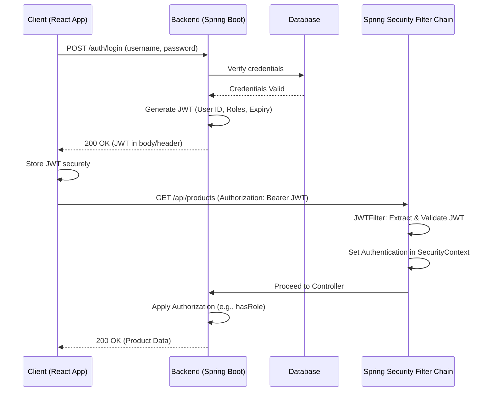

-----

# 🚀 Why Session Management Should Be Stateless in Modern Web APIs

As a backend engineer, understanding session management is crucial for building scalable, secure, and performant web APIs. Modern applications, especially those with decoupled frontends (like React, Angular, Vue) and microservices architectures, heavily favor **stateless session management**. Let's explore why.

-----

## 🔍 What Does "Stateless" Mean?

In the context of web development, "stateless" means that **the server does not store any information about the client's session state between requests**. Each request from the client to the server is treated as an independent transaction, containing all the necessary information for the server to process it.

  * **No Server-Side Session Data**: The server doesn't keep track of logged-in users, their preferences, or their previous interactions in its memory or database across multiple requests.
  * **Self-Contained Requests**: Every request sent by the client must contain all the information the server needs to fulfill it, including authentication details.
  * **JWT Enables Statelessness**: JSON Web Tokens (JWTs) are the de facto standard for achieving stateless sessions.
      * When a user logs in, the server generates a JWT containing user identity and authorization claims.
      * This JWT is sent to the client (e.g., in a response header).
      * For subsequent requests, the client includes this JWT (typically in the `Authorization` header as a `Bearer` token).
      * The server then **validates the token** (verifies its signature, checks expiry) and extracts the user information from the token itself, without needing to query a session store.

-----

## ⚖️ Stateless vs. Stateful Sessions (Brief Comparison)

Let's briefly compare the two paradigms to highlight their fundamental differences.

| Feature         | Stateful Sessions                                    | Stateless Sessions (e.g., JWT)                        |
| :-------------- | :--------------------------------------------------- | :------------------------------------------------------ |
| **Session Storage** | Server-side (e.g., in-memory, database, Redis)   | Client-side (JWT stored in browser localStorage, cookie) |
| **Common Use Case** | Traditional server-rendered web applications     | REST APIs, SPAs, Mobile Apps, Microservices             |
| **Scalability** | Harder to scale horizontally (sticky sessions needed) | Easier to scale horizontally (any server can handle request) |
| **Performance** | Server lookup for session data adds overhead         | Token validation is often faster than database lookup    |

-----

## 🧠 Why Choose Stateless Sessions?

Here's why modern web APIs gravitate towards stateless session management:

| Reason                | Explanation                                                                                                                                                                                                                                           |
| :-------------------- | :---------------------------------------------------------------------------------------------------------------------------------------------------------------------------------------------------------------------------------------------------- |
| 🚀 **Scalability** | Eliminates the need for "sticky sessions" where a user's requests must always go to the same server. Any server instance can handle any request, making horizontal scaling much simpler and more efficient (add more servers as needed).                     |
| 🔒 **JWT Support** | Perfectly aligns with **JSON Web Tokens (JWTs)**. The token itself contains all necessary user information, which is validated cryptographically. This eliminates server-side session lookups.                                                          |
| 🛡️ **Security** | Reduces the attack surface by not storing sensitive session data on the server. If a server is compromised, there are no active session records to steal. JWTs are signed to prevent tampering.                                                            |
| ⚡ **Performance** | No server-side session lookup is required for each request, reducing database/cache hits and improving response times. Token validation is often faster than round-trips to a session store.                                                               |
| 🏗️ **Microservices** | Essential for microservices architectures. Each microservice can validate the JWT independently without needing a shared session store, promoting loose coupling and independent deployment.                                                                  |
| 🧹 **No Session Cleanup** | Eliminates the complexity of session expiry, garbage collection, and management on the server side, simplifying backend logic and reducing resource consumption.                                                                                      |

-----

## ✅ Advantages of Stateless Session Management

  * **Improved Scalability**: Easily scale by adding more server instances without worrying about session replication or sticky sessions.
  * **Enhanced Performance**: Reduced server load due to no session storage or lookups.
  * **Simpler Architecture**: Fewer moving parts on the server-side related to session management.
  * **Mobile and SPA Friendly**: Ideal for single-page applications (SPAs) and mobile apps that consume APIs, as they can easily send tokens with each request.
  * **Microservices Ready**: Facilitates independent deployment and scaling of services, as each service can validate tokens autonomously.

-----

## ⚠️ Disadvantages of Stateless Sessions

While advantageous, stateless sessions do come with their own set of challenges:

| Disadvantage         | Explanation                                                                                                                                                                                                                             |
| :------------------- | :-------------------------------------------------------------------------------------------------------------------------------------------------------------------------------------------------------------------------------------- |
| 🚫 **No Immediate Logout** | JWTs are valid until they expire. A server cannot immediately "invalidate" a token once issued (unless a blacklisting mechanism is implemented, which adds state).                                                                       |
| 🔑 **Token Theft Risk** | If a JWT is stolen, the attacker can use it until it expires. Proper storage (e.g., HttpOnly cookies, secure local storage) and short expiry times are crucial.                                                                          |
| 📏 **Token Size** | JWTs can become large if they contain too much data, increasing payload size for every request. Keep claims minimal.                                                                                                                |
| 🗑️ **Revocation Complexity** | Revoking a compromised token or a token for a disabled user is harder. It typically requires a separate "blacklist" or "revocation list" on the server, which reintroduces a form of state.                                         |

-----

## 🌐 Real-World Use Case: React Frontend + Spring Boot Backend using JWT

Let's illustrate the stateless JWT flow:

1.  **User Login (Frontend):**
      * The React frontend captures username/password from the user.
      * It sends a `POST` request to `/auth/login` on the Spring Boot backend.
2.  **Backend Authentication:**
      * Spring Boot receives the credentials.
      * It authenticates the user (e.g., verifies against a database).
      * If successful, it generates a **JWT** containing user ID, roles, and expiry time.
      * The JWT is sent back to the React frontend in the response body or an `Authorization` header.
3.  **Frontend Stores JWT:**
      * The React app receives the JWT and securely stores it (e.g., in `localStorage` or an `HttpOnly` cookie).
4.  **Subsequent API Request (Frontend):**
      * The React app wants to access a protected resource, e.g., `/api/products`.
      * It retrieves the stored JWT.
      * It includes the JWT in the `Authorization` header of its request: `Authorization: Bearer <your_jwt>`.
5.  **Backend JWT Validation (Stateless):**
      * Spring Boot's custom JWT filter (configured via `HttpSecurity`) intercepts the request.
      * It extracts the JWT from the `Authorization` header.
      * It validates the JWT's signature and expiry *without needing to access any server-side session store*.
      * If valid, it extracts user details and roles from the token and sets them in Spring Security's `SecurityContext`.
6.  **Authorization & Response:**
      * Spring Security proceeds with authorization checks (e.g., "does this user have `ROLE_USER` to access `/api/products`?").
      * If authorized, the request reaches the controller, processes, and returns data to the React frontend.

<!-- end list -->



-----

## 🧪 Spring Security: Stateless Configuration Code

This is how you configure Spring Security for a stateless REST API using JWTs.

```java
import org.springframework.context.annotation.Bean;
import org.springframework.context.annotation.Configuration;
import org.springframework.security.config.annotation.web.builders.HttpSecurity;
import org.springframework.security.config.annotation.web.configuration.EnableWebSecurity;
import org.springframework.security.config.http.SessionCreationPolicy;
import org.springframework.security.web.SecurityFilterChain;
import org.springframework.security.web.authentication.UsernamePasswordAuthenticationFilter; // Or BasicAuthenticationFilter

// Assuming JwtTokenFilter is your custom JWT validation filter
// import com.yourproject.security.JwtTokenFilter;

@Configuration
@EnableWebSecurity
public class SecurityConfig {

    // You would typically inject your JwtTokenFilter here
    // @Autowired
    // private JwtTokenFilter jwtTokenFilter;

    @Bean
    public SecurityFilterChain securityFilterChain(HttpSecurity http) throws Exception {
        http
            // 1. Disable CSRF for stateless APIs
            .csrf(csrf -> csrf.disable())

            // 2. Configure session management to be stateless
            .sessionManagement(session -> session.sessionCreationPolicy(SessionCreationPolicy.STATELESS))

            // 3. Define authorization rules for HTTP requests
            .authorizeHttpRequests(authorize -> authorize
                // Public endpoints for authentication
                .requestMatchers("/auth/**", "/public/**").permitAll()
                // Protected API endpoints
                .requestMatchers("/api/**").authenticated()
                // Any other request requires no authentication (e.g., static resources, health checks)
                // Adjust this based on your application's specific needs.
                .anyRequest().permitAll()
            )

            // 4. Add your custom JWT filter before Spring's default authentication filter
            // This filter will validate the JWT and set the user in the SecurityContext
            // .addFilterBefore(jwtTokenFilter, UsernamePasswordAuthenticationFilter.class) // Or BasicAuthenticationFilter.class

            // 5. (Optional) Configure CORS if your frontend is on a different origin
            .cors(cors -> cors.disable()); // Or cors -> cors.configurationSource(yourCorsConfigurationSource()));

        return http.build();
    }

    // You would also define your PasswordEncoder, AuthenticationManager, and UserDetailsService beans here.
    // Also, the @Bean for your CorsConfigurationSource if enabling CORS explicitly.
}
```

-----

## 🧾 Summary Table: Stateless vs. Stateful

A final comparison to solidify your understanding.

| Feature             | Stateful Sessions                                    | Stateless Sessions (e.g., JWT)                        |
| :------------------ | :--------------------------------------------------- | :------------------------------------------------------ |
| **Session Handling** | Server-managed; ID exchanged                         | Client-managed (token); server validates token content |
| **Authentication Type** | Cookie-based, server session ID                    | Token-based (JWT)                                       |
| **Scalability** | Challenging; requires shared session storage/sticky sessions | Easy; any server can handle any request                 |
| **Logout Handling** | Immediate (destroy server session)                   | Delayed (token valid until expiry) or requires blacklisting |
| **Revocation Control** | Easy (delete session ID)                             | Harder; requires a revocation list (reintroduces state) |
| **Memory Usage** | Can consume significant server memory/database resources | Minimal server-side memory for authentication           |

-----

## ✍️ Final Tips

  * **Secure JWTs with HTTPS + HttpOnly**: Always transmit JWTs over HTTPS to prevent eavesdropping. For browser-based applications, consider storing JWTs in `HttpOnly` cookies to mitigate XSS (Cross-Site Scripting) attacks, though this reintroduces some session-like behavior (CSRF token needed). For SPAs, `localStorage` is common but requires careful handling.
  * **Use Short-Lived Access Tokens + Refresh Tokens**: Issue short-lived access tokens (e.g., 5-15 minutes) for API access. When an access token expires, use a longer-lived **refresh token** (stored securely, perhaps in a database and `HttpOnly` cookie) to obtain a new access token. This strategy improves security by limiting the window of exposure for a stolen access token and allows for "soft" logout by revoking only the refresh token.
  * **Protect Endpoints with `.hasRole()` / `.hasAuthority()`**: Beyond just `authenticated()`, use granular authorization. For example:
      * `.requestMatchers("/admin/**").hasRole("ADMIN")`
      * `.requestMatchers("/premium-feature/**").hasAnyAuthority("ROLE_PREMIUM", "ROLE_ADMIN")`
        This ensures only users with specific roles or authorities can access sensitive parts of your application.

Understanding and implementing stateless session management is a cornerstone of building robust and scalable modern web applications.
