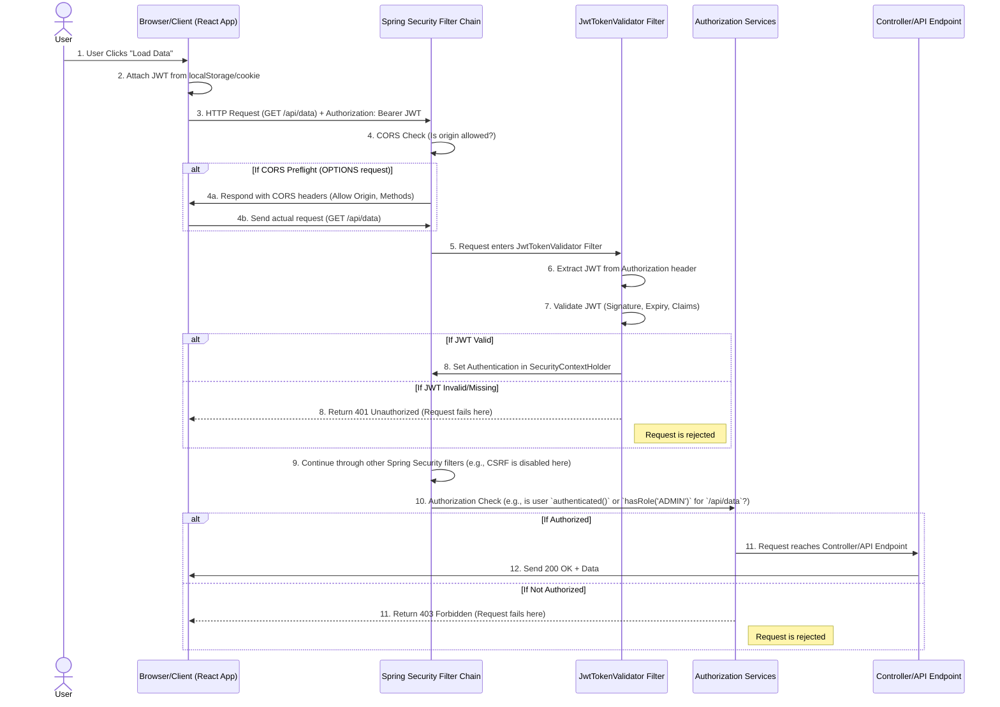

# 🔐 Explaining the Workflow of `securityFilterChain()` in Spring Security

As a Spring Boot backend engineer and educator, let's demystify the core of Spring Security's web configuration: the `SecurityFilterChain` method. This is where you define the security rules that govern how HTTP requests are handled by your application.

-----

## ✅ Overview: What This Method Does

The `securityFilterChain()` method, typically annotated with `@Bean` in a `@Configuration` class, is the heart of your Spring Security setup for web applications. Its primary purpose is to **configure and return a `SecurityFilterChain` object**.

  * **`SecurityFilterChain`**: This is an ordered list of security filters that Spring Security applies to every incoming HTTP request. Think of it as a series of checkpoints each request must pass through.
  * **`HttpSecurity`**: This is a powerful, fluent API (a DSL - Domain Specific Language) provided by Spring Security. It acts as a configuration helper, giving you methods to easily set up:
      * **Authentication**: How users prove their identity.
      * **Authorization**: What authenticated users are allowed to do.
      * **Session Management**: How user sessions are handled (stateful or stateless).
      * **CORS (Cross-Origin Resource Sharing)**: Rules for cross-domain browser requests.
      * **CSRF (Cross-Site Request Forgery)**: Protection against malicious requests.
      * **Custom Filters**: Integrating your own security logic into the chain.

In essence, this method builds the entire security blueprint for your web application.

-----

## 🔄 Line-by-Line Workflow Breakdown

Let's dissect each line of the provided `securityFilterChain()` configuration to understand its role in securing your API.

### `1. .csrf(csrf -> csrf.disable())`

  * **What is CSRF?** Cross-Site Request Forgery (CSRF) is an attack that tricks a logged-in user into performing an action on your web application without their knowledge. It typically exploits the fact that browsers automatically send session cookies with requests to the original domain.
  * **Why is it disabled here?** For **stateless REST APIs** that primarily use **token-based authentication (like JWTs)** and do not rely on session cookies, CSRF protection is generally disabled. This is because CSRF attacks primarily target session management via cookies. If your API doesn't use cookies for authentication, the risk is significantly reduced.
  * **Workflow Impact**: When disabled, Spring Security will not add the CSRF token check filter to the chain, simplifying requests for non-browser clients and modern SPAs using JWTs.

### `2. .sessionManagement(session -> session.sessionCreationPolicy(SessionCreationPolicy.STATELESS))`

  * **Stateless Session Policy**: This is a critical configuration for modern APIs. It instructs Spring Security that:
      * **No HTTP session will be created or used** by the server to store user data.
      * **Each request must be self-contained**, meaning all necessary authentication and authorization information (like a JWT) must be provided with every request.
  * **How it fits with JWT**: This setting is perfectly aligned with JWT authentication. When a JWT is used, the server receives the token, validates it (checks signature, expiry), and extracts user information directly from the token payload. It doesn't need to "remember" the user's state from a previous request.
  * **Workflow Impact**: By setting `SessionCreationPolicy.STATELESS`, the server becomes highly scalable as any server instance can handle any client request without needing to share session data. It also eliminates session-related overhead.

### `3. .authorizeHttpRequests(...)`

This is where you define the **authorization rules for specific URL patterns** within your application. Spring Security evaluates these rules in the order they are declared.

```java
.authorizeHttpRequests(authority ->
    authority
        .requestMatchers("/api/**").authenticated()
        .requestMatchers("/auth/signup", "/auth/login").permitAll()
        .anyRequest().permitAll()
)
```

| Path Pattern              | Rule                                      | Explanation                                                                                                                                                                                                                                                                                                                                 |
| :------------------------ | :---------------------------------------- | :------------------------------------------------------------------------------------------------------------------------------------------------------------------------------------------------------------------------------------------------------------------------------------------------------------------------------------------ |
| `/api/**`                 | `.authenticated()`                        | **🔐 Requires Authentication**: Any request to a URL starting with `/api/` (e.g., `/api/users`, `/api/products`) must be made by an authenticated user. This means the request must carry a valid JWT (or other form of authentication) that Spring Security has successfully verified. If not, the request will be rejected.                         |
| `/auth/signup`, `/auth/login` | `.permitAll()`                            | **✅ Public Access**: Requests to these specific paths are allowed to bypass authentication. This is essential because users need to sign up or log in *before* they can obtain an authentication token. Without this, no one could ever log in\!                                                                                                   |
| `anyRequest()`            | `.permitAll()`                            | **✅ Completely Open**: This is a catch-all rule. Any request that does not match the previously defined `requestMatchers` patterns will be permitted without authentication. This is common for serving static assets (like HTML, CSS, JS for a frontend if hosted by the backend), health check endpoints, or API documentation (e.g., Swagger UI). |

  * **Workflow Impact**: This step acts as a gatekeeper. After authentication (if required) is handled by the filters, this configuration determines if the authenticated (or unauthenticated) user has the necessary permissions to access the requested resource.

### `4. .addFilterBefore(new JwtTokenValidator(), BasicAuthenticationFilter.class)`

  * **Role of `JwtTokenValidator`**: This is your **custom JWT authentication filter**. Its primary responsibilities are:
    1.  **Extract JWT**: It intercepts incoming requests and looks for a JWT, typically in the `Authorization` header (e.g., `Bearer <token>`).
    2.  **Validate Token**: It then performs validation on the extracted token: checking its signature, expiry date, and other claims.
    3.  **Set `SecurityContext`**: If the token is valid, it constructs an `Authentication` object (containing user details and authorities/roles) and places it into `SecurityContextHolder.getContext().setAuthentication(authentication)`. This is how Spring Security "knows" who the current user is for the rest of the request processing.
  * **Runs Before `BasicAuthenticationFilter.class`**: By placing your `JwtTokenValidator` *before* Spring's standard `BasicAuthenticationFilter` (or `UsernamePasswordAuthenticationFilter`), you ensure that your token-based authentication mechanism runs first. If your JWT filter successfully authenticates the user, Spring's default authentication mechanisms are bypassed for that request.
  * **Workflow Impact**: This filter is essential for making your stateless JWT authentication work. It's the point where an incoming JWT is translated into an authenticated Spring Security principal.

### `5. .cors(cors -> cors.configurationSource(coresConfigurationSource()))`

  * **Briefly explain CORS setup**: This line enables and configures **Cross-Origin Resource Sharing**. CORS is a browser-enforced security mechanism that controls whether a web page (e.g., your React frontend) running on one domain is allowed to make requests to an API on a different domain.
  * **Why it's required for frontend-backend communication**: If your frontend (e.g., `http://localhost:5173`) and backend (e.g., `http://localhost:8080`) are on different origins (different protocols, domains, or ports), the browser will block cross-origin requests by default due to the Same-Origin Policy. The `coresConfigurationSource()` method (which you'd define separately) tells the browser which origins, HTTP methods, and headers are permitted to access your API.
  * **Workflow Impact**: Before your request even hits other security filters, the browser might send an `OPTIONS` preflight request. If the CORS configuration allows the origin and method, the actual request proceeds. This step is crucial for browser-based client applications.

### `6. return httpSecurity.build();`

  * **Finalizes Configuration**: This line is crucial\! After all the `HttpSecurity` methods have been called to define your security rules, `httpSecurity.build()` compiles these rules and creates the immutable `SecurityFilterChain`.
  * **Used by Spring Security**: This `SecurityFilterChain` bean is then registered with Spring Security, becoming the actual set of filters that will be applied to every incoming HTTP request to your application.

-----

## 🔁 Workflow Diagram

Let's visualize how a typical authenticated request flows through this configured `SecurityFilterChain`:



-----

## 📘 Bonus: Real-World Use Case

**Scenario**: You have a **React frontend hosted at `localhost:5173`** and a **Spring Boot backend API at `localhost:8080`**. The React app needs to fetch user posts from `/api/posts` after the user logs in using JWTs.

1.  **Login Flow**:

      * The user visits `http://localhost:5173`.
      * They enter credentials into the React app's login form.
      * React sends a `POST` request to `http://localhost:8080/auth/login`.
      * **Spring Security Action**: The `authorizeHttpRequests().requestMatchers("/auth/login").permitAll()` rule allows this request to pass through without an existing JWT. The backend authenticates the user and generates a JWT.
      * The backend responds with the JWT in the response body. React stores this JWT in `localStorage`.

2.  **Accessing Protected Resource (`/api/posts`)**:

      * The user clicks a button in React to "View My Posts."
      * React constructs a `GET` request to `http://localhost:8080/api/posts`.
      * **Crucially**: React retrieves the stored JWT and adds it to the `Authorization` header: `Authorization: Bearer <your_jwt_token>`.
      * **Spring Security Action (CORS)**: Because `localhost:5173` is different from `localhost:8080`, the browser might send an `OPTIONS` preflight request first. Your `.cors(...)` configuration would specify that `http://localhost:5173` is an allowed origin, allowing the main `GET` request to proceed.
      * **Spring Security Action (JWT Filter)**: The `JwtTokenValidator` (added with `addFilterBefore`) intercepts the `GET /api/posts` request. It finds the JWT in the `Authorization` header, validates its signature and expiry.
          * **If Valid**: It successfully authenticates the user and populates the `SecurityContext`.
          * **If Invalid (e.g., expired, tampered)**: The filter throws an authentication exception, and the request is immediately rejected with a `401 Unauthorized` status before it even reaches the authorization rules.
      * **Spring Security Action (Authorization)**: Assuming the JWT was valid, the request proceeds to the `authorizeHttpRequests()` part. The rule `.requestMatchers("/api/**").authenticated()` checks if the user is authenticated. Since the `JwtTokenValidator` successfully set the `Authentication` object, this check passes.
      * **Controller Execution**: The request finally reaches your `PostController` (or similar), fetches the posts, and returns them to the React frontend.
      * **If the user *was not* logged in or had an invalid JWT**, the `JwtTokenValidator` would have rejected the request, and the `PostController` would never be called.
